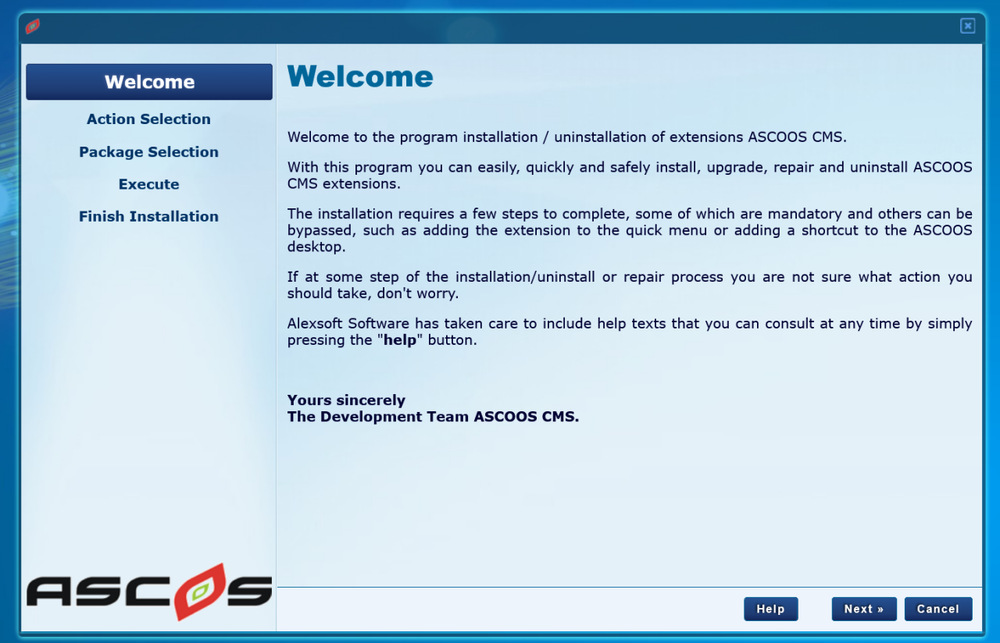
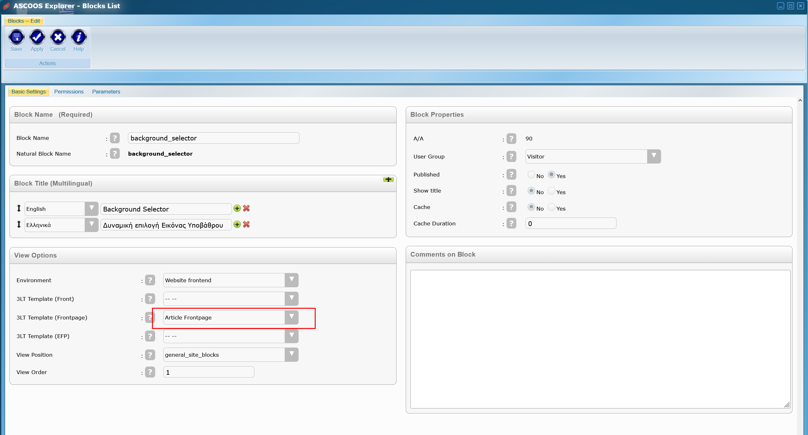
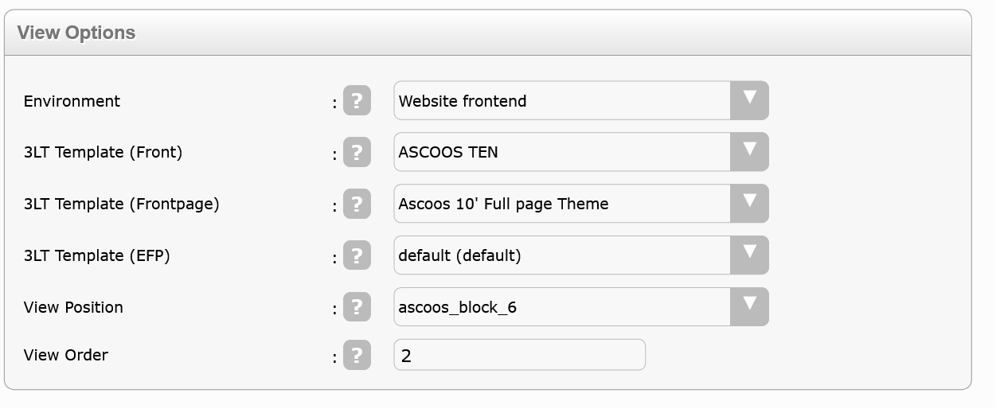
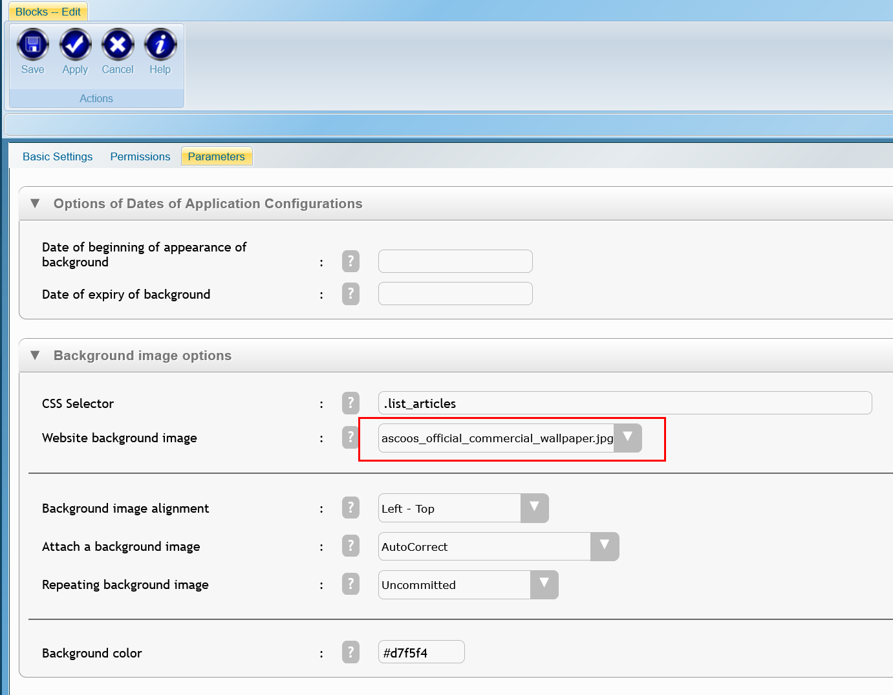
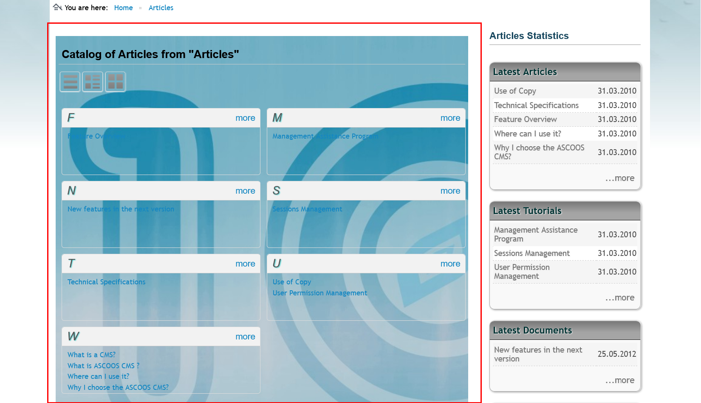
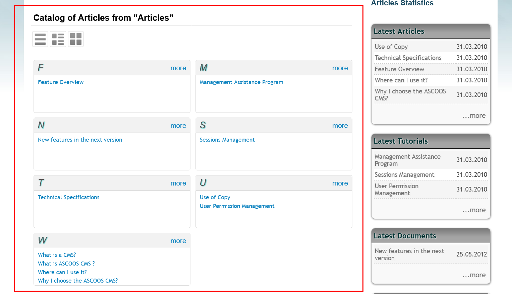

***

# How to use Block `background_selector` of Ascoos Cms.

This tutorial is divided into four steps.
1) Installing the `background_selector` Block
2) Editing and configuration of its parameters.
3) The result we have.

# Installation

The first step is to install the Block on the **Ascoos Cms** website we have.

Block is installed only through the built-in installer in the admin section.

From the **Ascoos Cms** desktop, double-click the `Installation Program` icon you see in the image below.

This will open us the installer, in which we will have to follow some easy steps to complete the installation of our block.

### Welcome
First the program welcomes us to the installer, giving us some information about it and the installation process.

### Action Selection
Here we select the two action steps of the installer.
- In the first step, we select the action `Install`, thus declaring to the installer that we will do a `new installation`. In case our block is already installed and we just want to upgrade it then we will choose `Extension Upgrade`.
In case we want to uninstall a component then we will select `Unistall`.
The first option `ASCOOS Upgrade' is for kernel version upgrade.

- In the second action step, we choose the type of our extension.
In our case here, we choose `Blocks`.

Then press the `Next` button to continue with the installation process.

### Select installation package

Here we are asked to select from our computer the compressed `zip` file containing the installation package.

The program also informs us that the installation package should be certified by AlexSoft Software to have all the necessary security safeguards for your system.

We press `Next` and since in this particular case we have no parameters that must be set during the installation process, the program will complete the installation.

We will press the `Close` button at the end and we will finish our work with the installer.

# Edit and configure the Block

On the **Ascoos Cms** desktop, double-click the `ASCOOS Explorer` icon to open the Ascoos component management program.

In the program that will open (see image below) we choose:

1) From the menu ribbon the `Blocks` tab to go to the Blocks management page.

2) we go to the `Views` section and from the drop-down named `Block` we select `background_selector`. This will show us in the list of blocks only the block with the title `Background Selector`.
3) In the displayed list, click on `Background Selector` to open our block for editing.

## 1. Edit the basic properties of the Block.

All Blocks in Ascoos Cms have their basic settings the same from the start.

From the editing page of the basic settings, we can adjust to the specific needs of each block, although the install.php file of our block's installation package takes care of presetting these specifics, as you can see in the image below.

### let's analyze these pieces of basic settings one by one.

1. `BLOCK NAME`: Here we give the name our block will have. In addition to letters and numbers, we can also use the hyphen `-` and underscore hyphen `_`.
     - `Block Name` : it is essentially the name of the copy of the physical block.
     - `Natural Block Name` : It is the natural name of the block as it is on the server disk. We can create as many copies of the block as we want. Of course, each one will have a different name.

2. `BLOCK TITLE` : Here we can give multilingual titles to our block. Of course we can only in the languages supported by our website. We can add, remove and sort the titles as we wish.

3. `VIEW OPTIONS` : Here we define the display parameters of the block.
    
    - `Envirenment` : The environment that will be displayed. e.g. in the image below, we tell it to appear in the foreground of the webpage. It could be set to appear in the admin section, newsletter, etc.
    
    - `3LT Template (Front)` : Each Ascoos Template consists of 3 layers, `front`, `frontpage` and `efp (encapsulation frontpage)`.`front` is the main part of the template and does not change.
    Within this the two other layers listed below can appear, but only a frontpage. While we can embed multiple `efp`.
    With the technology of 3LT Template, `Ascoos Cms', gives the possibility to adjust from page to page, from article to article, etc., without changing our basic visual part.
    
    - `3LT Template (Frontpage)`: The 2nd level of our template. It can contain individual code (like `native blocks`), contain as many `efp`s as we want but cannot contain another `frontpage` or `front`.
    
    - `3LT Template (EFP)` : The 3rd level of the template. can be integrated into the previous two as many times as we like.
    `CAUTION - BONUS` : The combination of the three layers can give enormous flexibility in the appearance of our components. E.g. we create two copies of the block with different settings and parameters and while the display position is the same, if the frontpage is different, we will have only one block displayed, while the other block will appear on the frontpage we set for it, when the page contains this the frontpage.
    E.g. in the program `articles` we define another `frontpage` and in the program `contacts` another, but both have display positions, e.g. the "position1". Depending on which `frontpage` or `efp` we define in our block settings, the corresponding one will appear.
    
    - `View Position` : The display position of the block. Each part of 3LT Templates can have different display positions. These are usually created during the template installation process, but can be created later as well.

    - `View Order` : The order that will appear inside the `View Position`.

4. `BLOCK PROPERTIES` : 

    - `A/A` : Auto Increment number. Generated from the database.

    - `User Group` : We declare the minimum user group access level.

    - `Published` : Should the block be published?

    - `Show Title` : Will the title of the block be displayed?

    - `Cache` : Include the final code of the block in the cache?

    - `Cache Duration` : Refresh rate of the data in the `Cache`, in seconds.

5. `COMMENTS ON BLOCK` : includes various comments the user wants to have about the block.

## 2. Permissions

How access rights work, not only for blocks but also for all components of **Ascoos Cms** is described in the video
[Ascoos Cms Blocks - Edit Permissions](https://www.youtube.com/watch?v=nqgJp10iquw) which is on youtube.

## 3. Edit Block's special parameters.
Each component of **Ascoos Cms** also has its own operating parameters. For the specific block are those shown in the following image.

1) `Options of Dates of Application Configurations`:
    
    - `Date of beginning of appearance of background` : The starting date of background implementation.

    - `Date of expiry of background` : The date of termination of the background.

2) `Background image options` :

      - `CSS Selector` : Give here the CSS item or items that you want they contain the selected picture of background. In the case of many elements should be separated by commas (eg, body,. Myclass, # myid).

      - `Website background image` : Select from the list of available images for the background of your page. Provided that you have the essential rights of access, you can change the root of your pictures is found, through the file params.php.

      - `Backgound image alignment` : Select the horizontal and vertical alignment of the image background. You are provided with 9 alignment options.

      - `Attach a background image` : Here you can select the method to attach the background image on your website. The method of automatic correction, make real and steady the image background when scrolling the page. The second method will result in scrolling the background image, along with the page content.

      - `Repeating background image` : Here you can choose whether the image will be repeated or not and the way of repetition. We provide 4 selections of repetition.

      - `Background Color` : Double-click in the  color input box to display the background color selection box. You can manually enter the color of your choice, in the form `RRGGBB` (Attention! Without the # in front).

## The result
At the end we select the `Save` button from the ribbon menu and go to the frontend of our page to see the results.

As an Administrator we have the ability to see our website fully functional, even if its elements are reserved for publication at a later time.

From the settings we see in the various images above, we will have a result on our page like the one below.

If we do not select an image for background then we will have an appearance like the following:

